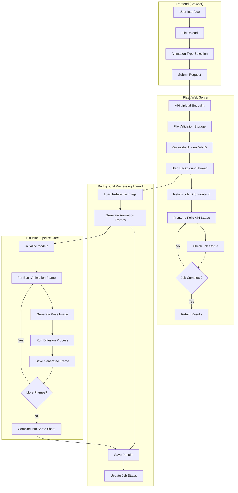
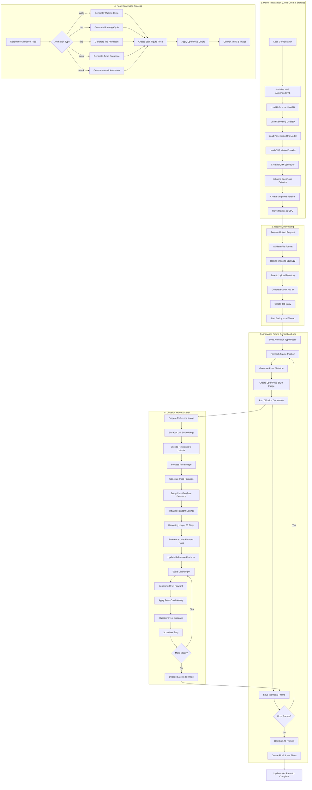
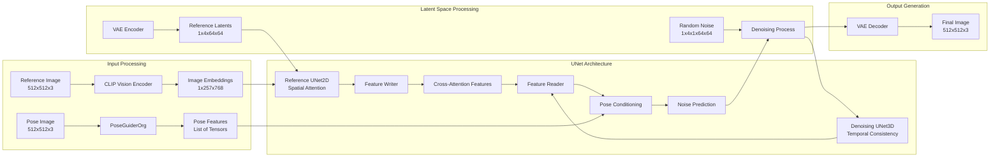
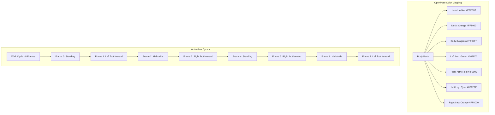
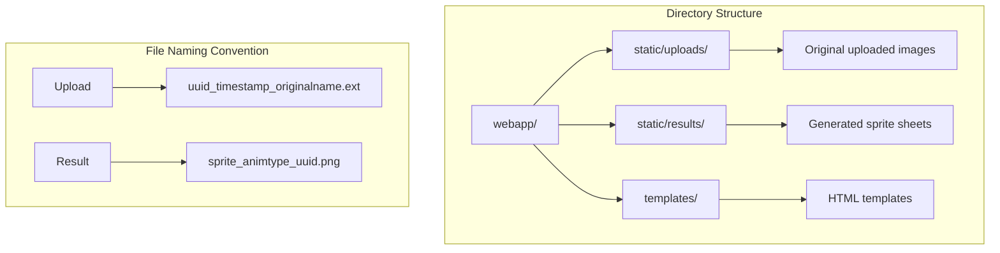
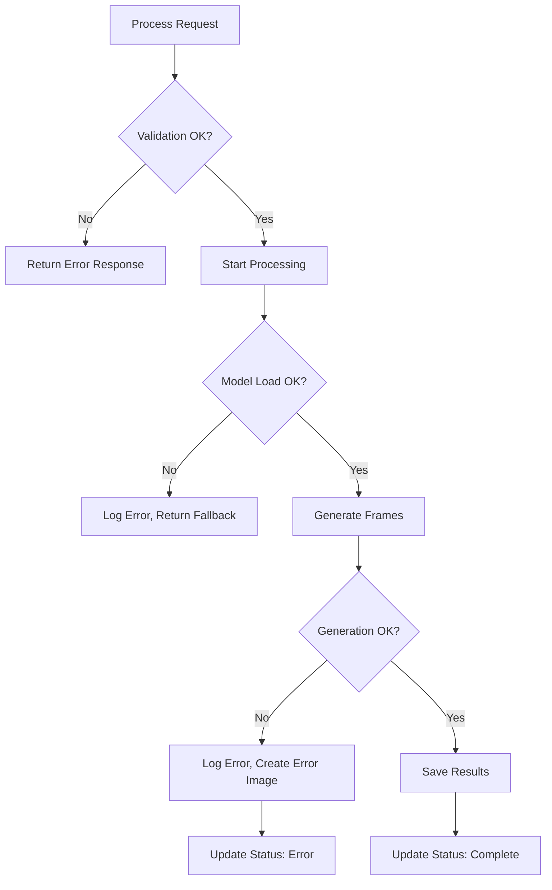
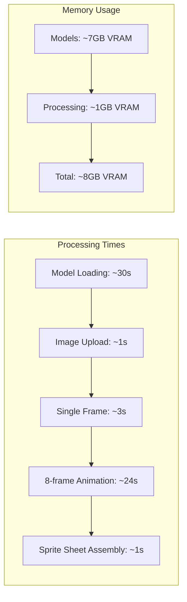
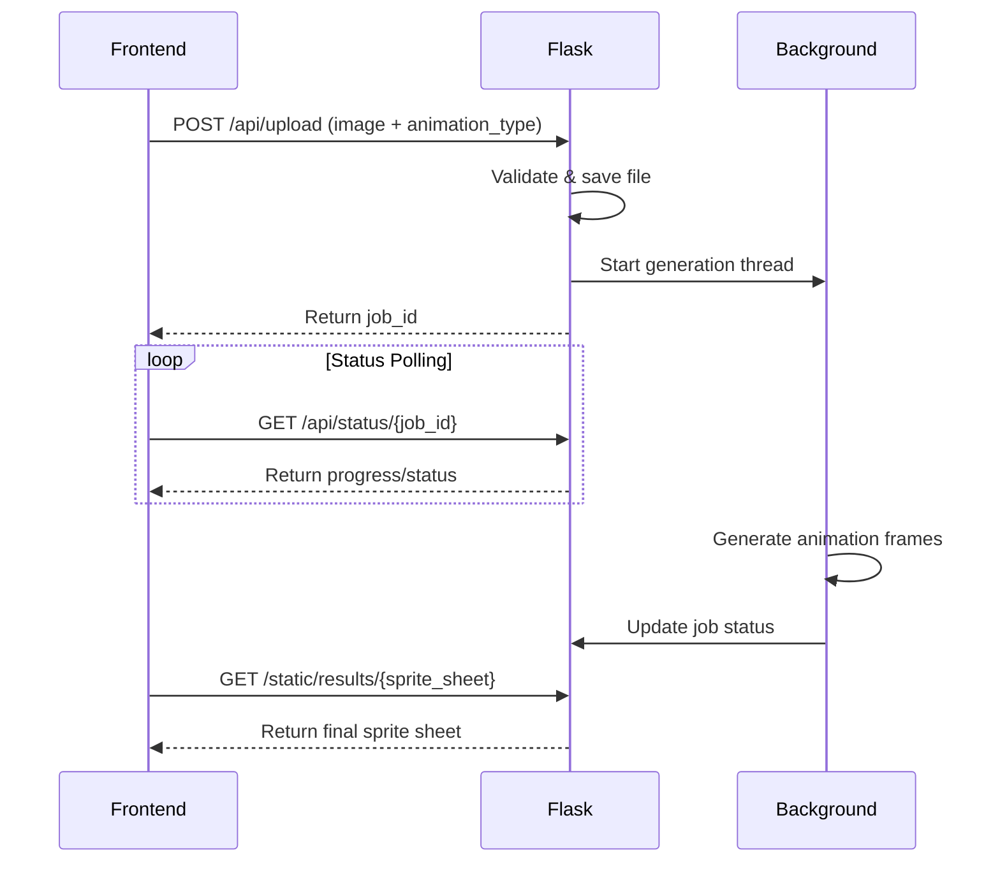

# Sprite Sheet Diffusion Pipeline Documentation

This document provides a comprehensive overview of the Sprite Sheet Diffusion web application pipeline, from frontend interaction to backend diffusion processing.

## Complete System Architecture

## Detailed Backend Processing Pipeline

## Model Architecture Details

## Pose Generation Coordinate System

## File System Structure

## Error Handling Flow

## Current Technical Issues

### Tensor Size Mismatch
The current implementation has a dimension mismatch issue:
- **Problem**: `The size of tensor a (32) must match the size of tensor b (64) at non-singleton dimension 4`
- **Location**: UNet3D forward pass when adding pose features
- **Cause**: PoseGuiderOrg output dimensions don't match UNet3D expectations at different resolution levels

### Proposed Solutions
1. **Resize pose features** to match expected dimensions at each UNet block
2. **Use interpolation** to adapt single pose feature to multiple resolution levels
3. **Switch to regular PoseGuider** if compatible weights are available

## Performance Characteristics

## API Endpoints

This pipeline handles the complete process from user interaction to final sprite sheet generation using the Sprite Sheet Diffusion model with pose conditioning and temporal consistency.